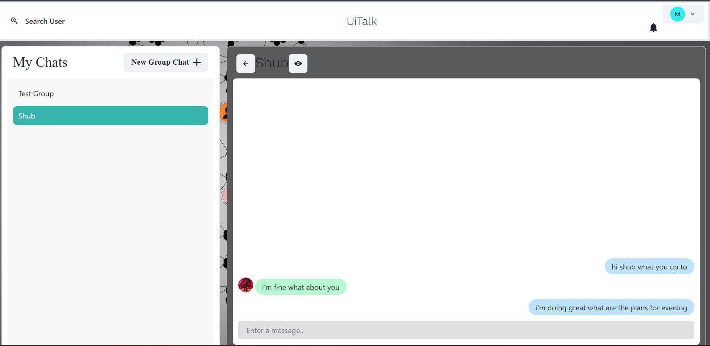

This MERN Full stack web application is a Realtime Personal Chat App built with **Node.js** development framework, **React.js** for frontend, **Express.js** for building REST API, **MongoDB** for database, **CHAKRA-UI-React** for the UI library and **Socket.IO** for bi-directional realtime communication. It supports **authentication with JSON Web Token**.Its backend is deloyed on **render** and for frontend **Netlify** is used.
It supports one on one chat as well as group chat and it has typing indicator to know that user at other end is typing.


the live link for the app- (https://meek-brigadeiros-46a6c5.netlify.app)


# DESCRIPTION


## Installation

Use the package manager [pip](https://pip.pypa.io/en/stable/) to install foobar.

```bash
pip install foobar
```

## Usage

```python
import foobar

# returns 'words'
foobar.pluralize('word')

# returns 'geese'
foobar.pluralize('goose')

# returns 'phenomenon'
foobar.singularize('phenomena')
```

## Contributing

Pull requests are welcome. For major changes, please open an issue first
to discuss what you would like to change.

Please make sure to update tests as appropriate.

## License

[MIT](https://choosealicense.com/licenses/mit/)
